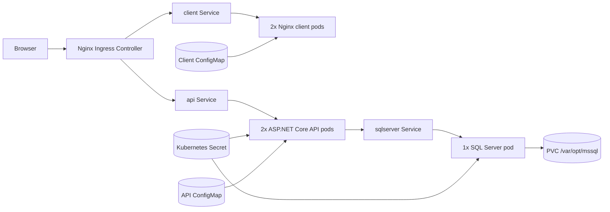

# SargentNexus Kubernetes deployment plan

## Decision log

1. **Workload split:** Separate pods for the Blazor client, ASP.NET Core API, and SQL Server.
2. **Kubernetes environment:** Local development cluster (minikube, kind, or Docker Desktop Kubernetes).
3. **Blazor hosting:** Dedicated Nginx pod serving the published WebAssembly assets.
4. **External access:** Nginx Ingress Controller.
5. **SQL Server persistence:** PersistentVolumeClaim using the cluster default `StorageClass`.
6. **Resource organization:** Single namespace, `sargent-nexus`.
7. **Replica count:** Start the API and client at 2 replicas each.
8. **Container image workflow:** CI/CD builds and pushes images; manifests reference image repository and tag placeholders.
9. **Environment strategy:** Helm chart with shared templates and environment-specific value overrides.

## Architecture



## Pod design

### Client pod

- Image source: `src/SargentNexus.Client/Dockerfile`
- Runtime: `nginx:alpine`
- Replicas: 2
- Purpose: Serve the Blazor WebAssembly static assets and SPA fallback routing
- Config inputs:
  - Nginx config from a `ConfigMap`
  - `appsettings.json` mounted from a `ConfigMap` with `ApiBaseUrl` set to `/`
- Health checks:
  - Liveness/readiness: TCP port 80

### API pod

- Image source: `src/SargentNexus.API/Dockerfile`
- Runtime: `mcr.microsoft.com/dotnet/aspnet:8.0`
- Replicas: 2
- Container port: 8080
- Purpose: Serve ASP.NET Core API endpoints and Swagger
- Config inputs:
  - `ASPNETCORE_ENVIRONMENT`, `ASPNETCORE_URLS`, and `Swagger__Enabled` from a `ConfigMap`
  - `ConnectionStrings__DefaultConnection` from the SQL Server secret
- Health checks:
  - Liveness/readiness: `GET /api/v1/health`

### SQL Server pod

- Image: `mcr.microsoft.com/mssql/server:2022-latest`
- Runtime shape: single replica, `Recreate` strategy
- Container port: 1433
- Purpose: Local-cluster database for SargentNexus
- Config inputs:
  - `ACCEPT_EULA=Y`
  - `MSSQL_PID=Developer`
  - `SA_PASSWORD` from the SQL Server secret
- Storage:
  - PVC mounted at `/var/opt/mssql`
- Health checks:
  - Liveness/readiness: `sqlcmd` exec probe

## Networking and ingress

- All workloads live in the `sargent-nexus` namespace.
- The chart creates three `ClusterIP` services:
  - `sargent-nexus-client`
  - `sargent-nexus-api`
  - `sargent-nexus-sqlserver`
- The Nginx ingress exposes a single host: `sargentnexus.localdev.me`.
- Recommended route layout:
  - `/` -> client service
  - `/api` -> API service
  - `/playground` -> API service for Swagger UI
  - `/swagger` -> API service for the OpenAPI document
- The Blazor client is configured to call the API through the same host, so the deployed application stays same-origin and avoids extra CORS complexity.

## Persistence design

- SQL Server uses a `PersistentVolumeClaim` named `sargent-nexus-sqlserver-data`.
- Access mode: `ReadWriteOnce`
- Default size: `20Gi`
- Storage class: cluster default, unless explicitly overridden in Helm values
- This is acceptable for local development. For production, move the database to a managed service rather than keeping stateful SQL Server inside the cluster.

## Secrets management

Never store secrets in source control. The checked-in `k8s\secrets\sqlserver-secret.template.yaml` is only a placeholder reference.

Create the real secret directly in the cluster at deploy time:

```powershell
kubectl create secret generic sqlserver-secret `
  --namespace sargent-nexus `
  --from-literal=sa-password='<SA_PASSWORD>' `
  --from-literal=connection-string='Server=sargent-nexus-sqlserver;Database=SargentNexus;User Id=sa;Password=<SA_PASSWORD>;TrustServerCertificate=True'
```

Recommendations:

1. Use `kubectl create secret` or an external secrets manager for real deployments.
2. Do not create and commit `sqlserver-secret.yaml` or any file containing the actual password.
3. If production uses a managed SQL Server endpoint, keep the same secret name but change the `connection-string` literal to the managed host.

## Resource limits and health recommendations

### Resource defaults

| Workload | Requests | Limits |
| --- | --- | --- |
| Client | `100m` CPU / `128Mi` memory | `250m` CPU / `256Mi` memory |
| API | `250m` CPU / `256Mi` memory | `500m` CPU / `512Mi` memory |
| SQL Server | `500m` CPU / `1Gi` memory | `1` CPU / `2Gi` memory |

### Health checks

1. **API:** `GET /api/v1/health`
2. **Client:** TCP probe on port 80
3. **SQL Server:** `sqlcmd` exec probe against localhost

### Deployment behavior

1. Use `RollingUpdate` for stateless workloads with `maxUnavailable: 0` and `maxSurge: 1`.
2. Use `imagePullPolicy: Always` in local/dev with mutable tags.
3. Use `imagePullPolicy: IfNotPresent` for stable, immutable tags or digests in production.

## Security and isolation

- A `NetworkPolicy` restricts SQL Server ingress to only pods labeled `tier=api` in the same namespace.
- The client pod has no direct path to the database.
- The API secret is limited to the database connection string it needs.
- Production deployments should replace the in-cluster SQL Server with a managed database and externalized secret management.

## Helm chart layout

The implementation uses a Helm chart under `k8s\`:

- `Chart.yaml`
- `values.yaml`
- `values.dev.yaml`
- `values.prod.yaml`
- `templates\`
- `secrets\`
- `README.md`

This keeps one set of templates while allowing local-dev and production-oriented value overrides.

## Deployment steps

1. Ensure your local cluster is running and the Nginx Ingress Controller is installed.
2. Build and push the API and client images through CI/CD.
3. Create the `sqlserver-secret` in the target namespace using placeholder-based `kubectl create secret` commands at deploy time.
4. Review image repositories and tags in the Helm values files.
5. Install or upgrade the chart:

   ```powershell
   helm upgrade --install sargent-nexus .\k8s `
     --namespace sargent-nexus `
     --create-namespace `
     -f .\k8s\values.dev.yaml
   ```

6. Verify pods, services, PVCs, and ingress.
7. Browse to `http://sargentnexus.localdev.me/`.

## Known limitations

1. The chart is optimized for a local development cluster, not a hardened production platform.
2. The SQL Server deployment is single-replica and uses a single PVC, so it does not provide database HA.
3. Production ingress, TLS, cert-manager integration, monitoring, and autoscaling are not included in this first pass.
4. `values.prod.yaml` raises baseline resources and pull policy expectations, but it should still be paired with a managed database strategy before real production use.

## Best-practice recommendations

1. **Never store secrets in source control.**
2. **Use a managed database for production SQL workloads.**
3. **Keep liveness and readiness probes enabled for all three workloads.**
4. **Set both resource requests and limits on every workload.**
5. **Use zero-downtime rolling updates for API and client deployments.**
6. **Use `Always` for mutable dev tags and `IfNotPresent` for immutable production tags.**
7. **Keep the SQL Server `NetworkPolicy` in place so only API pods can connect.**
